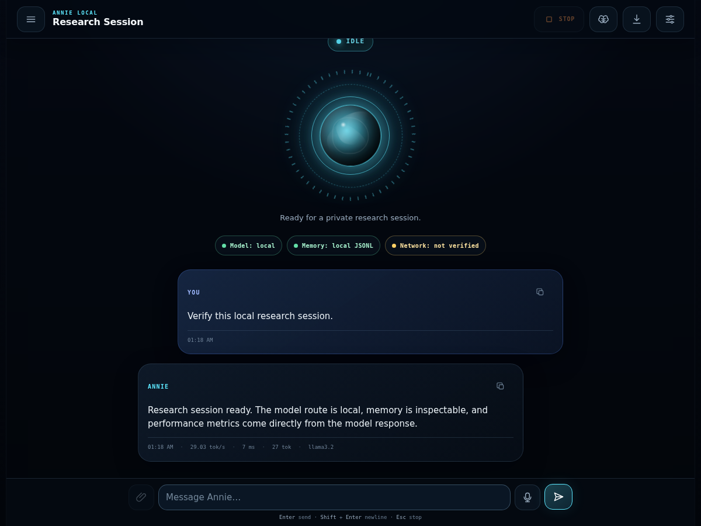

# Annie Local

<p align="center">
  
</p>

<p align="center">
  <strong>A polished local-first AI research session — visible model routing, inspectable memory, measurable performance, and no hidden UI dependencies.</strong>
</p>

<p align="center">
  <a href="https://github.com/MiMindMendinc/annie-local/actions/workflows/ci.yml"></a>
  <a href="LICENSE"></a>
  <a href="https://www.python.org/downloads/"></a>
  
  
  
  
  
</p>

---

**Annie Local** is a local-first AI companion with a mobile Research Session interface, care-first doctrine, inspectable memory, optional voice, and tool calling. The default setup talks to Ollama on your hardware. The packaged web interface uses no CDN or remote fonts, and the runtime shows whether configured model, memory, and voice routes are local, remote, or unverified.

If you want a local AI that feels *finished* instead of a science project, this is it.

## Why people use it

| You get | You don't get |
|---------|----------------|
| FABLE-5 phosphor UI with scanner + typewriter | Another bare chat box |
| Memory that learns goals, facts, journal | Cloud memory harvest |
| Tool calling (remember, recall, goals) | Vendor lock-in |
| WOPR voice bridge + mic input | Required subscriptions |
| One command to launch | — |
| Docker production stack (Postgres, Redis, JWT, S3) | Cloud lock-in |

## Quick start (3 commands)

```bash
curl -fsSL https://raw.githubusercontent.com/MiMindMendinc/annie-local/main/scripts/install.sh | bash
ollama pull llama3.2
annie launch
```

Or manually:

```bash
git clone https://github.com/MiMindMendinc/annie-local.git
cd annie-local
pip install -e .
ollama pull llama3.2   # one-time
annie launch --model llama3.2
```

Open **http://127.0.0.1:8787**

## Production stack (Docker)

Full production deployment with PostgreSQL, Redis, MinIO (S3), JWT auth, rate limiting, and async workers:

```bash
cp .env.example .env
docker compose up -d --build
docker compose exec ollama ollama pull llama3.2
```

See [docs/RUNBOOK.md](docs/RUNBOOK.md) for migrations, auth, and troubleshooting.

### First-run check

```bash
annie doctor    # probes Ollama, models, voice bridge, data paths
annie setup     # guided install if something is missing
```

## Features

- **Research Session interface** — responsive glowing orb, explicit activity states, message metrics, and touch-friendly controls
- **Care engine** — honest, long-term-good doctrine (editable in Settings → cfg)
- **Adaptive memory** — profile, facts, goals, journal at `~/.annie/knowledge.json`
- **Tool loop** — remember, recall, goals, journal, datetime via Ollama tools
- **Voice** — WOPR bridge on `:8123` or clearly labeled browser-managed fallback; mic via Web Speech
- **Session control** — clear conversation, restart epoch, export/wipe memory
- **FastAPI backend** — layered architecture: routers → services → repositories
- **Production middleware** — JWT auth, CORS, rate limiting, security headers, structured logging
- **PostgreSQL + Redis + S3** — horizontal-scaling ready (docker-compose)

## Optional: WOPR voice

Run your local voice bridge (LuxTTS + pedalboard chain):

```bash
python wopr_server.py   # http://127.0.0.1:8123
```

In Annie: **cfg** → set WOPR voice bridge URL → toggle **voice**.

## Where your data lives

| Path | What |
|------|------|
| `~/.annie/memory.jsonl` | Conversation history |
| `~/.annie/knowledge.json` | Profile, facts, goals, journal |
| `~/.annie/settings.json` | Model, temperature, doctrine |

Delete anytime. It's your machine.

## Verify before you ship a build

```bash
pip install -e ".[dev]"
python3 -m pytest -q          # 47+ tests
./scripts/canary_test.sh      # adversarial safety canaries
```

The deterministic browser showcase, exact capture commands, and compact accessibility/privacy acceptance checklist are in [docs/RESEARCH_SESSION_QA.md](docs/RESEARCH_SESSION_QA.md).

## API (local only)

```bash
curl http://127.0.0.1:8787/api/health
curl -X POST http://127.0.0.1:8787/api/chat \
  -H 'Content-Type: application/json' \
  -d '{"message":"hello"}'
```

Bind stays on `127.0.0.1` by default — not exposed to your network.

## Status

**v0.3.0 — local-first companion with optional production stack.**

Not a therapist, crisis line, or compliance-certified clinical tool. See [docs/PRIVACY_AND_SAFETY.md](docs/PRIVACY_AND_SAFETY.md) and [docs/THREAT_MODEL.md](docs/THREAT_MODEL.md).

## Docs

- [Getting started](docs/GETTING_STARTED.md)
- [Run book (production)](docs/RUNBOOK.md)
- [Grounding substrate overview](docs/GROUNDING.md) — how safety works (no secret rules exposed)
- [Voice stack](docs/VOICE.md) — local STT/TTS, WOPR, limitations
- [Research Session QA](docs/RESEARCH_SESSION_QA.md) — reproducible showcase and acceptance checklist
- [Canary benchmark results](docs/CANARY_RESULTS.md) — published pass/fail rates
- [Replit deployment](docs/REPLIT.md)
- [Changelog](CHANGELOG.md)
- [Roadmap](docs/ROADMAP.md)

## Operator tools

```bash
annie doctor              # stack check + recent grounding triggers
annie grounding           # full redacted audit log
annie grounding --verify  # hash chain integrity
python3 scripts/run_canary_benchmark.py   # refresh CANARY_RESULTS.md
```

## License

MIT — [Michigan MindMend Inc.](LICENSE)

<p align="center">
  <sub>If Annie helps you, a star on GitHub helps others find local-first AI.</sub>
</p>
