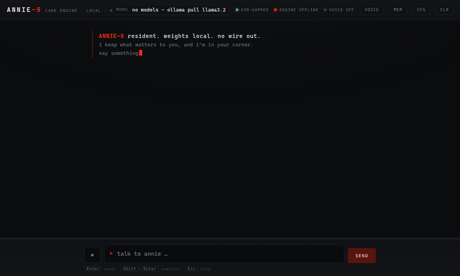
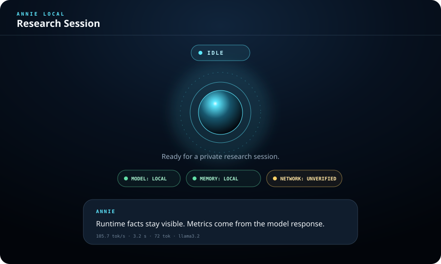

# Annie Local

<p align="center">
  
</p>

<p align="center">
  
</p>

<p align="center">
  <strong>Private local AI that looks and feels like FABLE-5 — runs on your machine, remembers what matters, never phones home.</strong>
</p>

<p align="center">
  <a href="https://github.com/MiMindMendinc/annie-local/actions/workflows/ci.yml"></a>
  <a href="LICENSE"></a>
  <a href="https://www.python.org/downloads/"></a>
  
  
</p>

---

**Annie-5** is a fully local AI companion: FABLE-5 terminal aesthetic, care-first doctrine, adaptive memory, voice, and tool calling — all through Ollama on your own hardware. No API keys. No telemetry. No CDN.

If you want a local AI that feels *finished* instead of a science project, this is it.

## Why people use it

| You get | You don't get |
|---------|----------------|
| FABLE-5 phosphor UI with scanner + typewriter | Another bare chat box |
| Memory that learns goals, facts, journal | Cloud memory harvest |
| Tool calling (remember, recall, goals) | Vendor lock-in |
| WOPR voice bridge + mic input | Required subscriptions |
| One command to launch | Docker compose maze |

## Quick start (3 commands)

```bash
curl -fsSL https://raw.githubusercontent.com/MiMindMendinc/annie-local/main/scripts/install.sh | bash
ollama pull llama3.2
annie launch
```

Or manually:

```bash
git clone https://github.com/MiMindMendinc/annie-local.git
cd annie-local
pip install -e .
ollama pull llama3.2   # one-time
annie launch --model llama3.2
```

Open **http://127.0.0.1:8787**

### First-run check

```bash
annie doctor    # probes Ollama, models, voice bridge, data paths
annie setup     # guided install if something is missing
```

## Features

- **FABLE-5 interface** — monochrome phosphor terminal, Larson scanner, herald block
- **Care engine** — honest, long-term-good doctrine (editable in Settings → cfg)
- **Adaptive memory** — profile, facts, goals, journal at `~/.annie/knowledge.json`
- **Tool loop** — remember, recall, goals, journal, datetime via Ollama tools
- **Voice** — WOPR bridge on `:8123` or browser TTS fallback; mic via Web Speech
- **Session control** — clear conversation, restart epoch, export/wipe memory
- **FastAPI backend** — `/api/chat`, `/api/knowledge`, `/api/settings`, `/api/health`

## Optional: WOPR voice

Run your local voice bridge (LuxTTS + pedalboard chain):

```bash
python wopr_server.py   # http://127.0.0.1:8123
```

In Annie: **cfg** → set WOPR voice bridge URL → toggle **voice**.

## Where your data lives

| Path | What |
|------|------|
| `~/.annie/memory.jsonl` | Conversation history |
| `~/.annie/knowledge.json` | Profile, facts, goals, journal |
| `~/.annie/settings.json` | Model, temperature, doctrine |

Delete anytime. It's your machine.

## Verify before you ship a build

```bash
pip install -e ".[dev]"
python3 -m pytest -q          # 22+ tests
./scripts/canary_test.sh      # adversarial safety canaries
```

## API (local only)

```bash
curl http://127.0.0.1:8787/api/health
curl -X POST http://127.0.0.1:8787/api/chat \
  -H 'Content-Type: application/json' \
  -d '{"message":"hello"}'
```

Bind stays on `127.0.0.1` by default — not exposed to your network.

## Status

**v0.2.0 — ready for real use on your own hardware.**

Not a therapist, crisis line, or compliance-certified clinical tool. See [docs/PRIVACY_AND_SAFETY.md](docs/PRIVACY_AND_SAFETY.md) and [docs/THREAT_MODEL.md](docs/THREAT_MODEL.md).

## Docs

- [Getting started](docs/GETTING_STARTED.md)
- [Changelog](CHANGELOG.md)
- [Roadmap](docs/ROADMAP.md)

## License

MIT — [Michigan MindMend Inc.](LICENSE)

<p align="center">
  <sub>If Annie helps you, a star on GitHub helps others find local-first AI.</sub>
</p>
