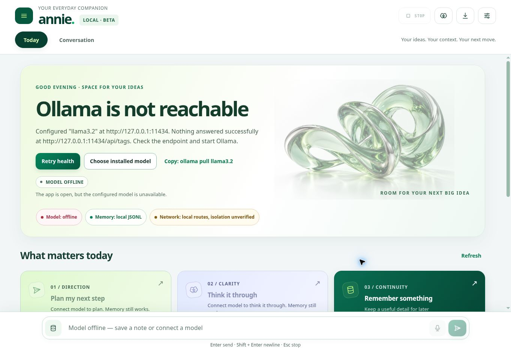

# Annie Local

<p align="center">
  <strong>A local-first companion for your ideas, your context, and your next step.</strong>
</p>

<p align="center">
  <a href="https://github.com/MiMindMendinc/annie-local/actions/workflows/ci.yml"></a>
  <a href="LICENSE"></a>
  <a href="https://www.python.org/downloads/"></a>
  
  
  
  
  
</p>

---

**Annie Local** brings conversations, personal context, and a practical goal board into one bright workspace. Save what matters, choose a goal, and ask Annie to help you take the next step. Default setup talks to Ollama on your hardware. The web UI uses no CDN. Runtime badges show whether model, memory, and voice routes are local, remote, or unverified.

v0.4.0 candidate (unreleased). Not a clinical product.

## Meet your Today workspace

Annie’s visual identity pairs original emerald-glass artwork with vivid green accents, larger typography, and distinct surfaces for planning, conversation, and memory. The artwork ships inside the app, so the interface needs no image CDN.



Today workspace in repair mode. The screenshot shows the unavailable-model state. Real-model API checks are recorded in the [readiness report](docs/RELEASE_READINESS.md); a ready-state browser capture is still required.

*Actual running page with synthetic test notes and Ollama stopped. Memory and goal controls remain usable; planning becomes available when the configured model is ready.*

1. **Make it yours.** Add a profile note: what to call you, what you are working on, and how you like to be helped.
2. **Pick a next move.** Add a goal directly to the board. Complete it or reopen it with one click.
3. **Make it manageable.** Choose **Plan my next step** to ask your configured model for a 15-minute action based on your saved goals. Planning can read context but cannot change saved knowledge or mark goals complete.
4. **Keep the useful bits.** Save a fact, goal, profile note, or journal entry through **Remember something**. Inspect, export, or delete stored knowledge anytime.

Memory capture and goal controls work without a running model. Chat and generated plans require the configured Ollama model. Saved context is included in future model conversations when **Knowledge tools** is enabled. No personal profile is bundled with the code.

See [Today workspace guide and verification](docs/TODAY_WORKSPACE.md).

## Capabilities

| Capability | Current scope |
| --- | --- |
| Mobile conversation UI | Visible model, memory, voice, and network status |
| Inspectable memory | Goals, facts, profile, and journal stored on disk by default |
| Tool calling | Remember, recall, goals, journal, and datetime |
| Optional voice | Local WOPR output; browser voice locality is unverified |
| Local launch | FastAPI with Ollama on loopback by default |
| Compose reference | PostgreSQL, Redis, and JWT; public hosting gates remain open |

## Quick start

```bash
git clone https://github.com/MiMindMendinc/annie-local.git
cd annie-local
python -m pip install -e .
ollama pull llama3.2
annie launch
```

Open **http://127.0.0.1:8787**.

Already installed from this repository? Stop Annie, run `git pull --ff-only` and `python -m pip install -e .` in your checkout, then run `annie launch` again. The Today workspace opens by default. If no model is available, **Connect model** opens Settings; memory capture and goal controls remain available.

An install helper is available at `scripts/install.sh`. Inspect it locally
before running it; the documented path above does not pipe code from the
network directly into a shell.

To select a different installed model:

```bash
annie launch --model llama3.2
```

## Hardened Compose reference

The Compose profile provides PostgreSQL, authenticated Redis, JWT auth, per-user session state, rate limiting, Ollama, and a worker. It is a controlled showcase / deployment foundation. Public deployment still needs TLS, managed secrets, backups, monitoring, and an external review.

```bash
cp .env.example .env
# Fill JWT_SECRET, POSTGRES_PASSWORD, and REDIS_PASSWORD with unique 32-byte secrets.
docker compose config --quiet
docker compose up -d --build
docker compose exec ollama ollama pull llama3.2
```

See [docs/RUNBOOK.md](docs/RUNBOOK.md) for migrations, auth, and troubleshooting.

### First-run check

```bash
annie doctor    # probes Ollama, models, voice bridge, data paths
annie setup     # guided install if something is missing
```

## Features

- **Today workspace** — bright green companion interface, saved context, goal board, and model-generated next-step plans
- **Conversation** — responsive orb, activity states, message metrics, touch-friendly controls
- **Care engine** — honest, long-term-good doctrine (editable in Settings → cfg)
- **Adaptive memory** — profile, facts, goals, journal at `~/.annie/knowledge.json`
- **Tool loop** — remember, recall, goals, journal, datetime via Ollama tools
- **Voice** — `annie launch` auto-starts local WOPR on `:8123` when possible; browser fallback is labeled locality unverified
- **Session control** — clear conversation, restart epoch, export/wipe memory
- **FastAPI backend** — routers → services → repositories
- **Production middleware** — JWT, CORS, rate limiting, security headers, structured logging
- **PostgreSQL + authenticated Redis** — optional Compose path
- **S3-compatible service foundation** — present in code; attachment API/UI is not enabled in this candidate

## Local voice on launch (WOPR)

```bash
sudo apt-get install espeak-ng
python -m annie.wopr_server --self-test
annie launch
```

For Piper, set `WOPR_PIPER_MODEL=/path/to/voice.onnx`. Skip auto-start with `annie launch --voice-bridge off`. See [docs/VOICE.md](docs/VOICE.md).

## Where your data lives

| Path | What |
|------|------|
| `~/.annie/memory.jsonl` | Conversation history |
| `~/.annie/knowledge.json` | Profile, facts, goals, journal |
| `~/.annie/settings.json` | Model, temperature, doctrine |

These are the default local storage paths. Saved context can be sent to the configured model endpoint; remote model routes and optional PostgreSQL storage change that boundary. Inspect, export, or delete stored knowledge through the app.

## Verify before you ship a build

```bash
pip install -e ".[dev,prod]"
python3 -m pytest -q
node --test tests/ui_*.test.js
./scripts/canary_test.sh
ruff check .
ruff format --check .
bandit -q -r src --severity-level medium
pip-audit --strict -r requirements-prod.lock
python -m build
```

Showcase and accessibility checklist: [docs/RESEARCH_SESSION_QA.md](docs/RESEARCH_SESSION_QA.md).

## API (local only)

```bash
curl http://127.0.0.1:8787/api/health
curl -X POST http://127.0.0.1:8787/api/chat \
  -H 'Content-Type: application/json' \
  -d '{"message":"hello"}'
```

Bind stays on `127.0.0.1` by default.

## Status

**v0.4.0 candidate — local-first beta; release gates remain open.**

Not a therapist, crisis line, compliance-certified clinical tool, or finished public multi-user service. See [docs/PRIVACY_AND_SAFETY.md](docs/PRIVACY_AND_SAFETY.md), [docs/THREAT_MODEL.md](docs/THREAT_MODEL.md), and [docs/STATUS.md](docs/STATUS.md).

## Docs

- [Getting started](docs/GETTING_STARTED.md)
- [Run book](docs/RUNBOOK.md)
- [Grounding](docs/GROUNDING.md)
- [Voice](docs/VOICE.md)
- [UI QA](docs/RESEARCH_SESSION_QA.md)
- [Canary results](docs/CANARY_RESULTS.md)
- [Changelog](CHANGELOG.md)
- [Roadmap](docs/ROADMAP.md)

## Operator tools

```bash
annie doctor
annie grounding
annie grounding --verify
python3 scripts/run_canary_benchmark.py
```

## License

MIT — [Michigan MindMend Inc.](LICENSE)

First-run model unavailable? Run `annie doctor` for the configured endpoint and repair commands, or `annie setup` for a download-confirming setup flow. Settings lists installed models and requires an explicit choice to save an unavailable name. See [first-run recovery](docs/GETTING_STARTED.md#repair-a-first-run-model-connection).

The candidate includes operator repair mode, model selection, and cancellable generation. Real local-model checks cover chat, valid Direction and Clarity plans, model recovery, and memory preservation. Text remains buffered for complete-response grounding; immediate token-by-token display is not implemented. Physical phone, accessibility, and ready-state browser evidence remain open. See the [readiness report](docs/RELEASE_READINESS.md) and [device and release QA](docs/DEVICE_QA.md).
