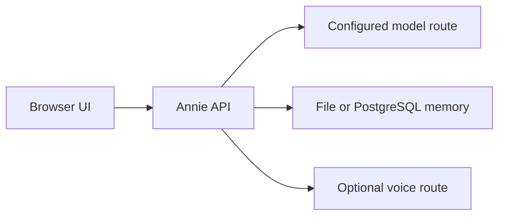

# Annie Local Threat Model

## Purpose

Annie Local is a local-first AI interface prototype using a browser UI, local server, local model routing, and local memory. This document describes the main risks the project is designed to reduce and the risks it does not solve by itself.

## Assets to Protect

- user prompts and responses
- local memory files
- local logs
- model endpoint configuration
- API keys or provider tokens, if configured
- microphone input, once voice paths are added
- browser session data
- user trust in local/offline claims

## Trust Boundaries

Important boundaries:

- user input is sensitive
- model output is untrusted
- local memory is sensitive
- local server endpoints should not be exposed to untrusted networks by default
- configured model routing must be verified before claiming offline operation

## Primary Threats

### Unexpected Remote Data Egress

Risk: users believe Annie Local is fully local while model calls, browser assets, analytics, fonts, scripts, or media are loaded remotely.

Mitigations:

- document endpoint configuration
- review browser dependencies
- provide offline dependency checklist
- avoid claiming fully offline unless verified

### Local Memory Exposure

Risk: local memory files may contain private user messages and be readable by other users or processes on the same machine.

Mitigations:

- document memory path
- provide deletion/reset commands
- avoid storing secrets
- future encrypted memory option

### Unsafe Emotional Reliance

Risk: users rely on Annie Local as a therapist, crisis responder, or replacement for human support.

Mitigations:

- clear non-claims
- crisis boundary language
- supportive but bounded responses
- human escalation direction

### Local API Exposure

Risk: local server binds too broadly, exposing chat or memory endpoints to other devices.

Mitigations:

- bind to `127.0.0.1` by default
- document network binding risks
- avoid exposing local memory routes publicly

### Prompt Injection / Unsafe Model Output

Risk: user prompts or model output may include unsafe, manipulative, or privacy-invasive behavior.

Mitigations:

- safety wrapper direction
- output boundaries
- synthetic tests
- optional integration with TrustLayer-style gateway

## Out of Scope

Annie Local alone does not solve:

- clinical diagnosis
- therapy
- crisis intervention
- malicious local administrators
- physical device compromise
- complete model safety
- all prompt-injection attacks
- compliance certification

## Production Hardening Backlog

- [ ] local memory encryption option
- [x] memory delete/reset command
- [x] offline dependency checklist and observable route status
- [x] local-only browser asset bundling
- [x] bind-address documentation
- [ ] optional TrustLayer safety gateway integration
- [x] STT/TTS local routing documentation
- [x] safety tests for crisis-boundary responses
- [ ] professional privacy/security review before sensitive deployment
- [x] per-user session, grounding-audit, and restart-state isolation in the reference deployment
- [ ] external security/privacy review before public multi-user deployment

## Crisis Boundary

Annie Local is not a crisis service. If someone may be in immediate danger, contact local emergency services. In the United States, call or text **988** for the Suicide & Crisis Lifeline.
